# SkillSwap Screenshots 📸

This section provides a visual walkthrough of the SkillSwap application, showing the complete user flow from authentication to skill exchange.

---

## Authentication

### Register Page
Users can create a new account by providing basic details such as name, email, and password.

### Login Page
Registered users can log in using their email and password to access the platform.

---

## Home Page

### Home (Before Login)
Public landing page displaying an overview of the platform and its purpose.

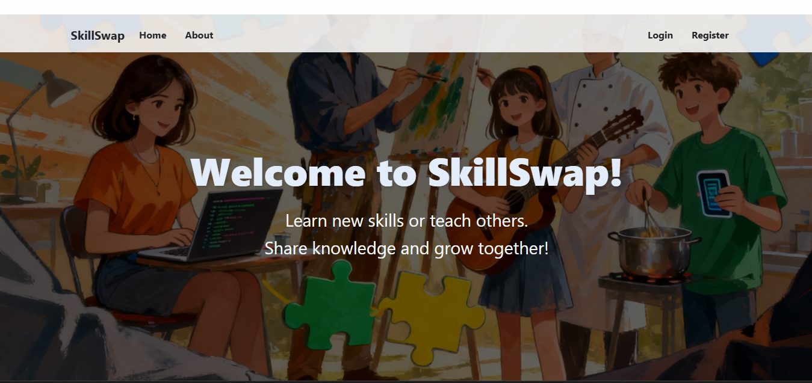

### Home (After Login)
Personalized home page showing available skills and navigation options after successful login.

---

## About Page
Provides information about the SkillSwap platform and its purpose.

---
## Skill Management

### Add Skill – Form
Shows the skill creation form where the user enters the skill name, description, and proficiency level.

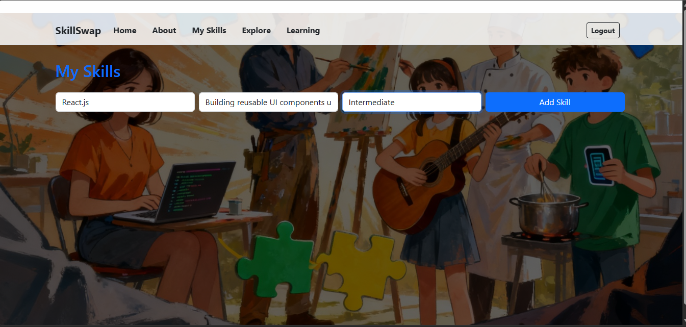

### Add Skill – After Submission
Displays the updated skills list after successfully adding a new skill.

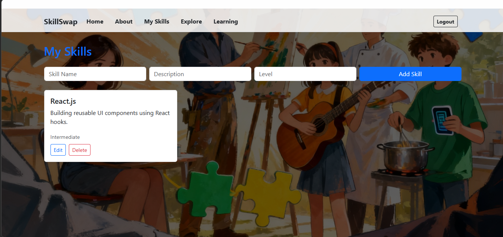

### My Skills
Displays all skills added by the logged-in user, with options to manage them.

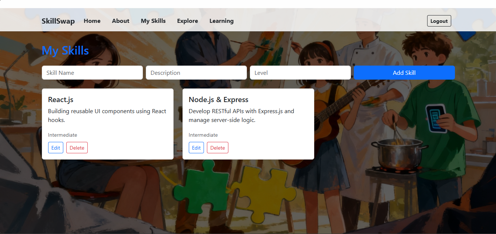

### Edit Skill
Allows users to update the details of an existing skill such as name, description, or proficiency level.

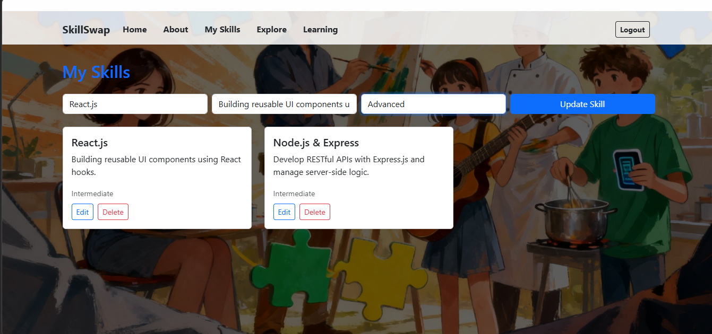

### Delete Skill
Allows users to permanently remove a skill from their profile.

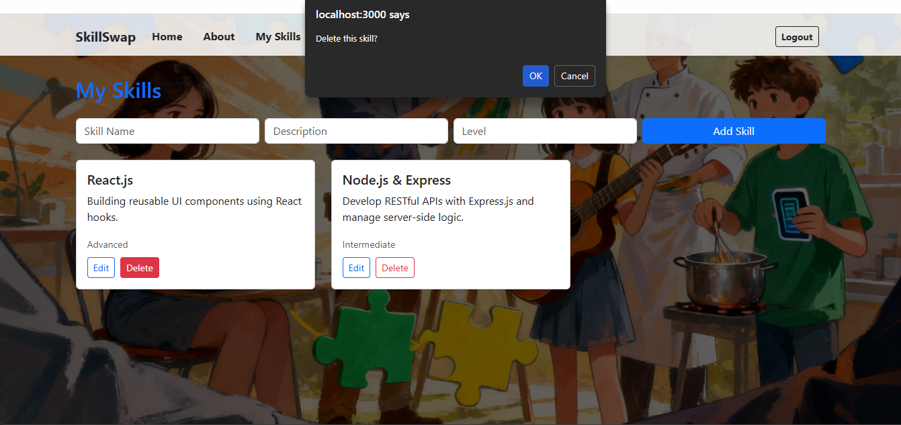

### Explore Skills
Allows users to browse skills offered by other users on the platform.

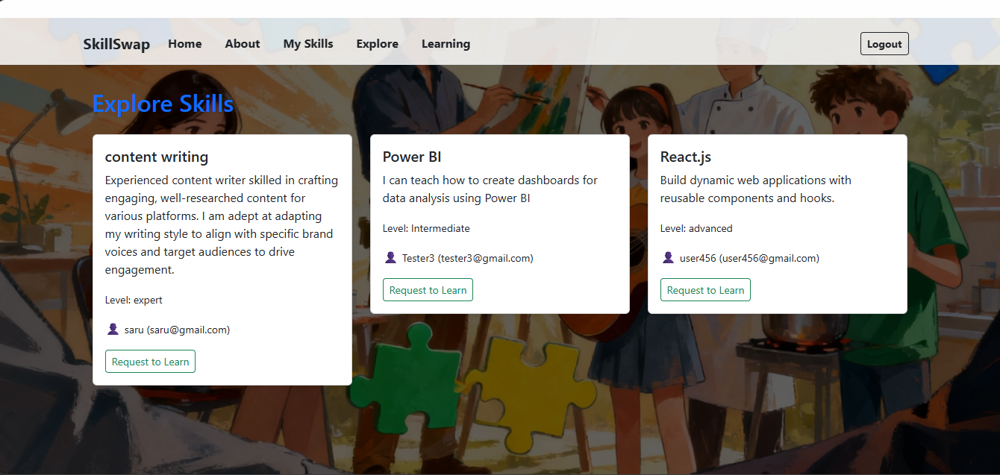

---

## Skill Requests

### Send Skill Request
Users can send a skill request to another user to initiate skill exchange.

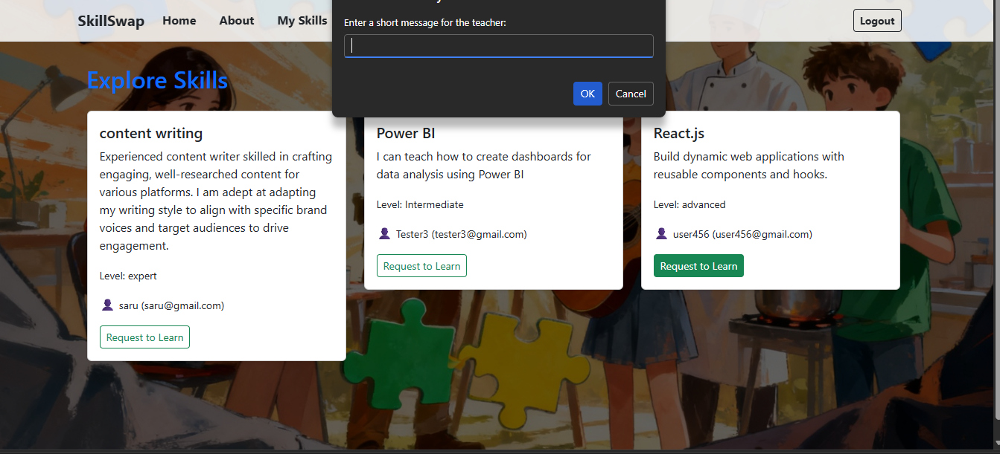

## Learning Dashboard

The Learning Dashboard is a centralized page where users can manage all skill exchange requests.  
It shows **sent requests**, **received requests**, and the **status of each request** (pending or accepted) on the same page.

### 📤 Sender View – Sent Requests
Shows the requests sent by the logged-in user along with their current status.

Example:
To user456 – Skill: React.js (Pending)

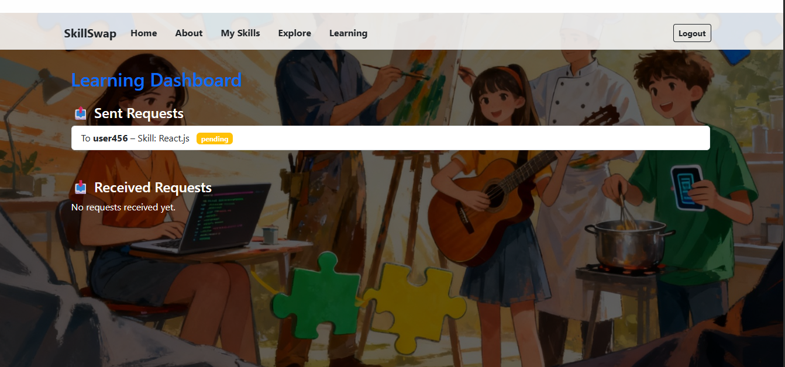

### 📥 Receiver View – Before Accepting
Shows the incoming request for **user456** before it is accepted.  
The user can see the request and has options to **Accept** or **Reject**.

Example:
From user123 – Skill: React.js (Pending)

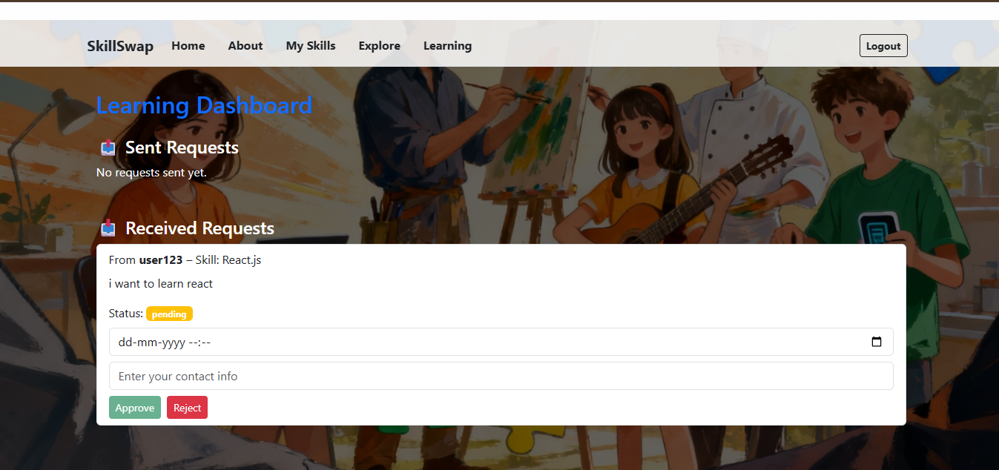

---

### 📥 Receiver View – After Accepting
Shows the same request for **user456** after it has been accepted.  
The status now shows **Accepted**, and the user can proceed to chat or coordinate learning.

Example:
From user123 – Skill: React.js (Accepted)

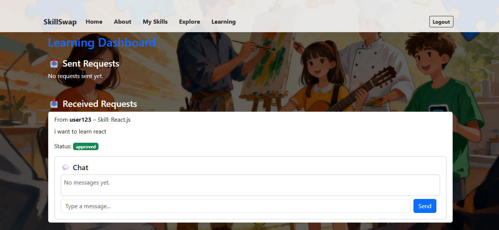
---

### 📤 Sender View – After Acceptance
Shows the sent request from **user123**’s perspective after **user456 accepted** it.  
The status now shows **Accepted**.

Example:
To user456 – Skill: React.js (Accepted)

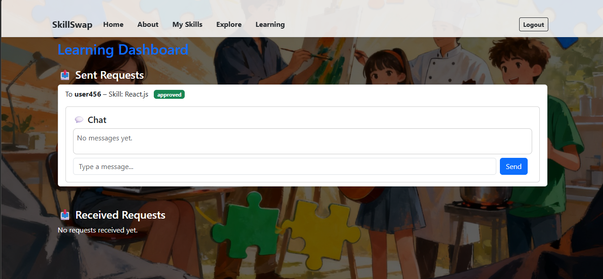

--------

## Chat System

Chat functionality becomes available **only after a skill request has been accepted**.  
Users can then communicate directly to coordinate learning or skill exchange.

### Chat List
Displays all active conversations initiated after request acceptance.

### One-to-One Chat
Allows users to send and receive messages in real time with another user.

user123 chat 
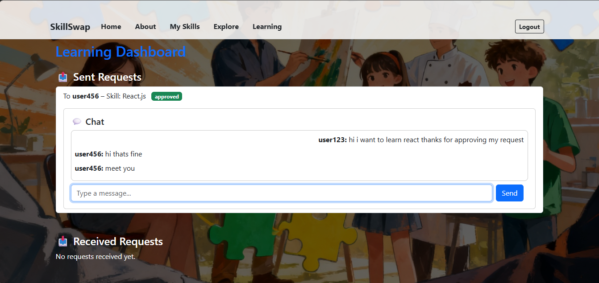

user456 chat 
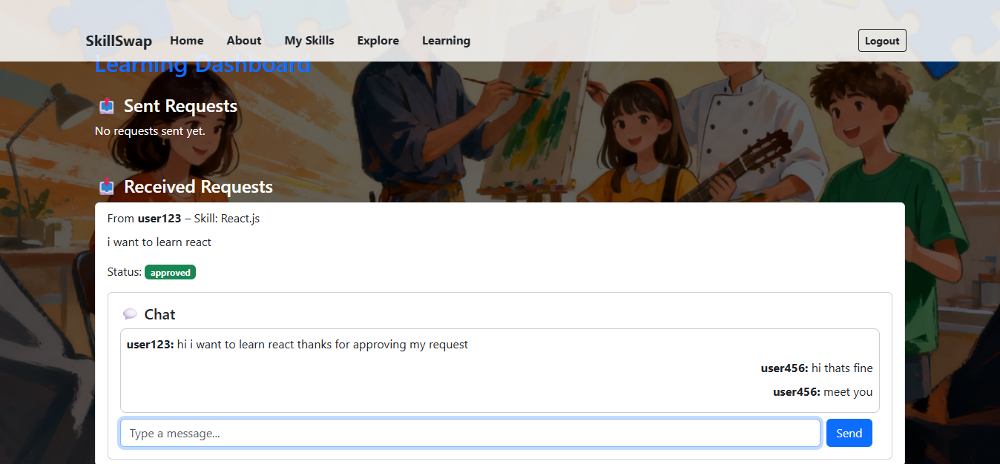

---

## Live Application

🔗 [See Live App on Netlify](https://skill-swap-project.netlify.app/)

